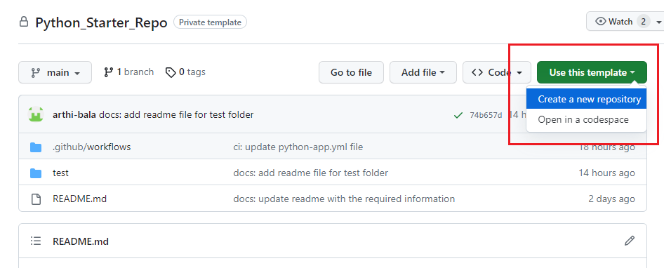
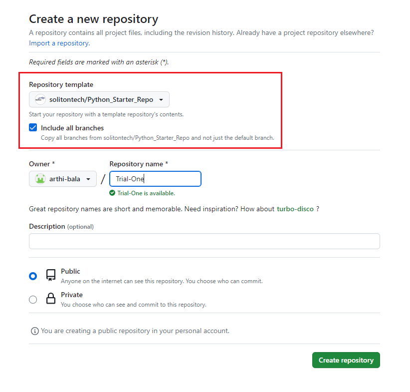

#
# 🎯 Python 🐍 Starter Repo
🔰 This folder contains all the documentation related to this starter repo with the required assets.

🔰1️⃣ While creating new repo add the “Python_Starter_Repo” template repository 

<kbd>

</kbd>

.

🔰2️⃣ Include all the branches of template repository and name your repository. Then click "create repository"

<kbd>

</kbd>

.

🔰3️⃣ Now you have successfully created the repository using python template repository

🔰4️⃣ Add all the git hook scripts available inside docs folder to your local .git/hooks folder. Refer - [git hooks](./git%20hooks.md)

🔰5️⃣ After adding git hook scripts, install "poetry" in your local system using the below command.

    pip install poetry

🔰6️⃣ After installing "poetry", create a virtual environment of the current repo using the below command.

    poetry config virtualenvs.in-project true
    poetry shell

🔰7️⃣ After creating virtual environment, activate your virtual environment using below command. Always remember to activate virtual environment while coding.

    .venv\Scripts\activate.bat

🔰8️⃣ If you want to deactivate the virtual environment, the give the below command in your terminal or cmd.

    .venv\Scripts\deactivate.bat

🔰9️⃣ Then install all the dependencies added in "pyproject.toml" file using the below command.

    poetry install

🔰1️⃣0️⃣ If you want to add any dependency to developement, then use the below command to add that dependency.

    poetry add <package-name> --group dev

🔰1️⃣1️⃣ If you want to add any dependency to test, then use the below command to add that dependency.

    poetry add <package-name> --group test

🔰1️⃣2️⃣ Now you are good to start with your assignments. Happy Coding ;)

#
#  🧐🧐 Please Note 🧐🧐

🔰1️⃣ Create a branch from main for each assignments (or) create develop branch from main branch and create branches for each assignments from develop branch (as instructed by your mentors)

🔰2️⃣ Place all you assignment files inside "src" folder.

🔰3️⃣ Place all your unit testing files inside "tests/unit" folder.
 
🔰4️⃣ After adding your assignment files raise PR to main or develop branch (as instructed by your mentors)
 
🔰5️⃣ If all the validation is success you can merge to main or develop branch (as instructed by your mentors)

🔰6️⃣ Please go through git branch naming and commit message guidelines for better understanding. Refer - [guidelines](./guidelines%20for%20git.md) 

🔰7️⃣ Always try to format the code before pushing it to the repository using black

    black .
If you want to format files present in separate folder, then use the command : `black <folder-name>` \
eg. black src, black tests

🔰8️⃣ Always check the your code with linters before pushing it to the repository using below commands,

**flake8**

    flake8 <folder-name> --show-source

**pydocstyle**

    pydocstyle <folder-name>

**mypy**

    mypy --pretty <folder-name>

🔰9️⃣ Install the above libraries using `pip`.
