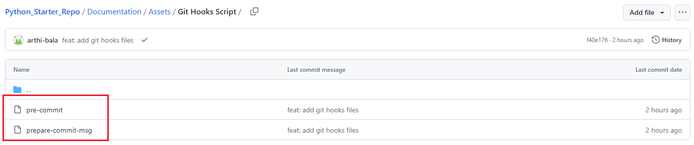
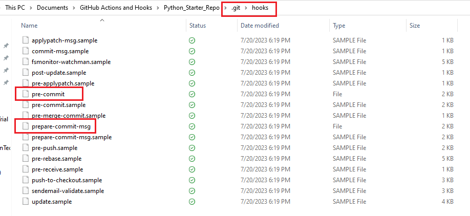
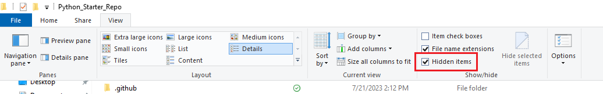

#
# 🎯 Git Hooks
🔰 Git hooks are scripts or programs that can be executed automatically by Git at specific points in the version control workflow. 

🔰 They allow you to enforce certain policies, perform automated checks, or trigger custom actions before or after certain Git events, such as committing code, pushing changes, merging branches, and more.

🔰 Git hooks are located in the .git/hooks directory of your Git repository. Each hook is a shell script or executable program with a predefined name. 

🔰 When you initialize a new Git repository, it comes with a set of sample hooks that are named with a .sample extension. 

🔰 To use them, you need to remove the .sample extension from the hooks you want to enable.

.

#
# 🎯 How to add git hooks in your local repo

🔰1️⃣ After creating your repository with Python_Starter_Template you can see two shell scripts inside [/docs/assets/git hooks script](./assets/git%20hooks%20script)

<kbd>

</kbd>

.

🔰2️⃣ Copy both the files and add it inside the directory .git/hooks/

<kbd>

</kbd>

.

🔰3️⃣ If .git directory is not visible, then click on View and check Hidden File

<kbd>

</kbd>

.

🔰4️⃣ After adding git will execute these shell script and validate commit message and branch name while making commits

.

#
# 🎯 Pre-commit hook
This hook runs before a commit is created. It allows you to perform pre-commit checks such as linting, code formatting, or running unit tests to ensure that code meets certain quality standards before being committed. Here we have used this pre commit hook to validate branch name.

.

#
# 🎯 Prepare-commit-msg
This hook is generally useful for adding or modifying information in the commit message just before the user is prompted to edit it. Here we use this hook to validate the commit message.

.
