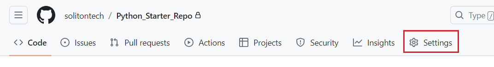
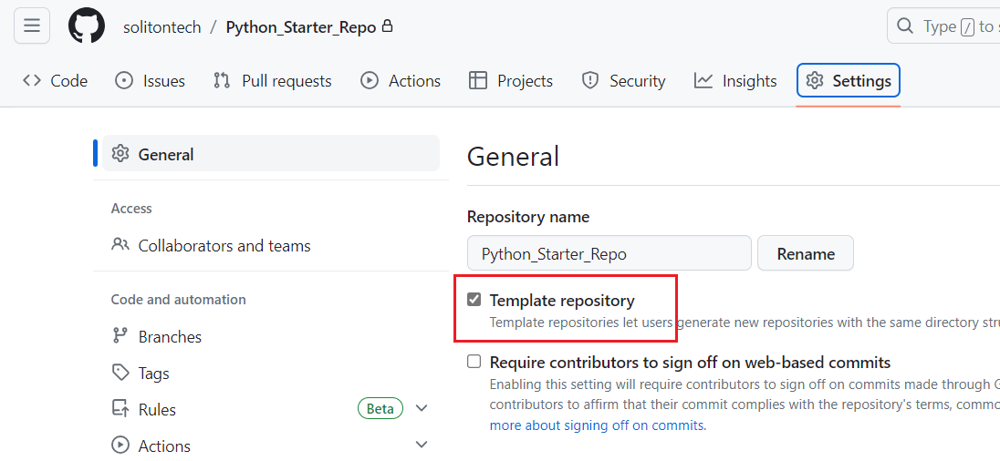
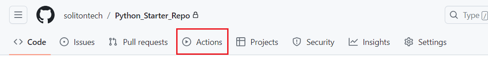
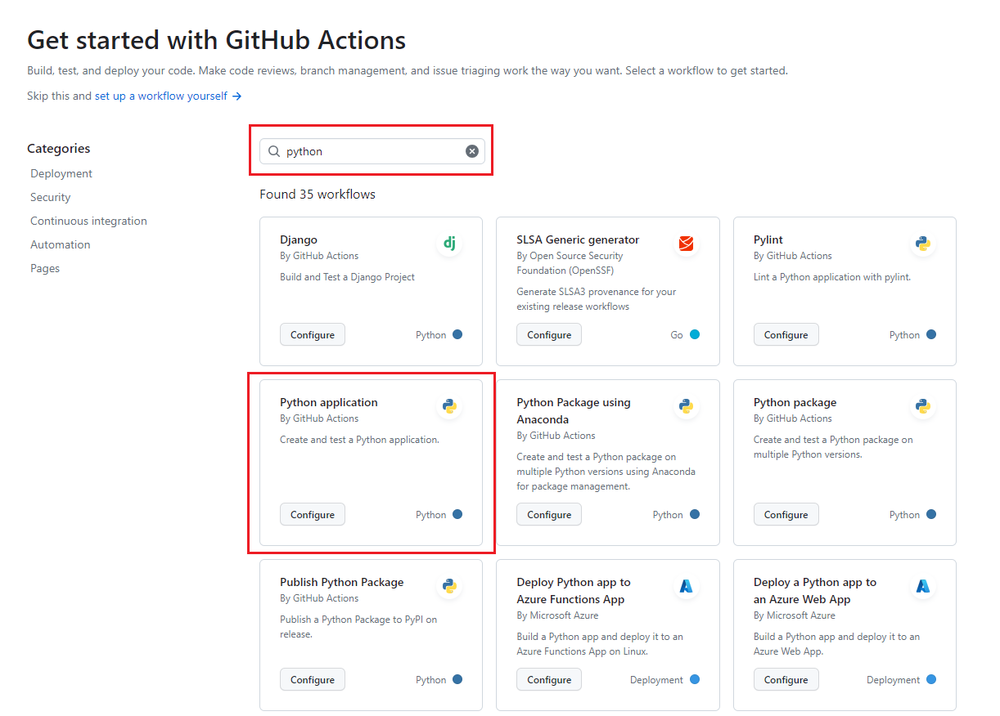
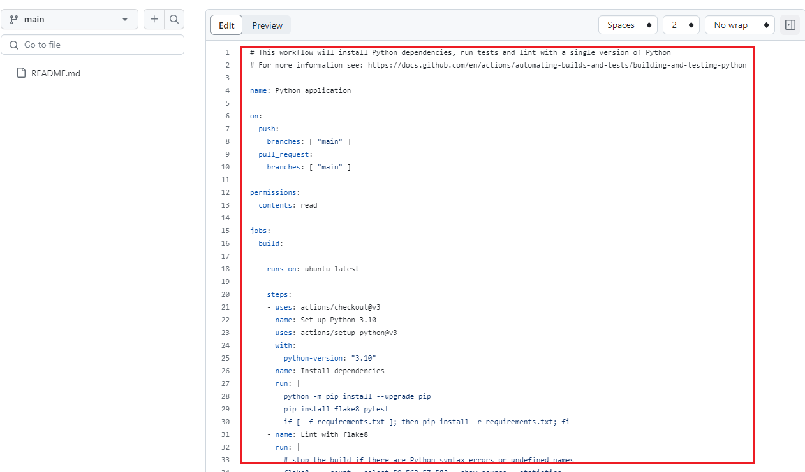

#
# 🎯 Python Starter Repo
🔰 Starter Template Repo for Python🐍 Assignments

#
# 🔗 QuickLinks
🔗 [How to create template repository](./python%20starter%20repo.md#-how-to-create-template-repository)\
🔗 [How to create workflow](./python%20starter%20repo.md#-how-to-create-workflow)

#
# 🎯 How to create template repository
🔰1️⃣ Login to your GitHub account

🔰2️⃣ Create new repository

      - Click “new” button in the dashboard 
      - Give appropriate name for your repository 
      - Select Private/Public and add README file 
      - Finally click create repository. 

🔰3️⃣ After creating new repository go to settings

<kbd>

</kbd>

.

🔰4️⃣ Select the template repository check box

<kbd>

</kbd>

.

🔰5️⃣ Now your repository will be a template repository

.

#
# 🎯 How to create workflow

🔰1️⃣ Open your repository and go to actions 

<kbd>

</kbd>

.

🔰2️⃣ Search for Python Application configuration in the search bar

<kbd>

</kbd>

.

🔰3️⃣ Click configure and the python-app.yaml file will be added to your workflow 

🔰4️⃣ Configure the yaml file as per your requirement

<kbd>

</kbd>

.
